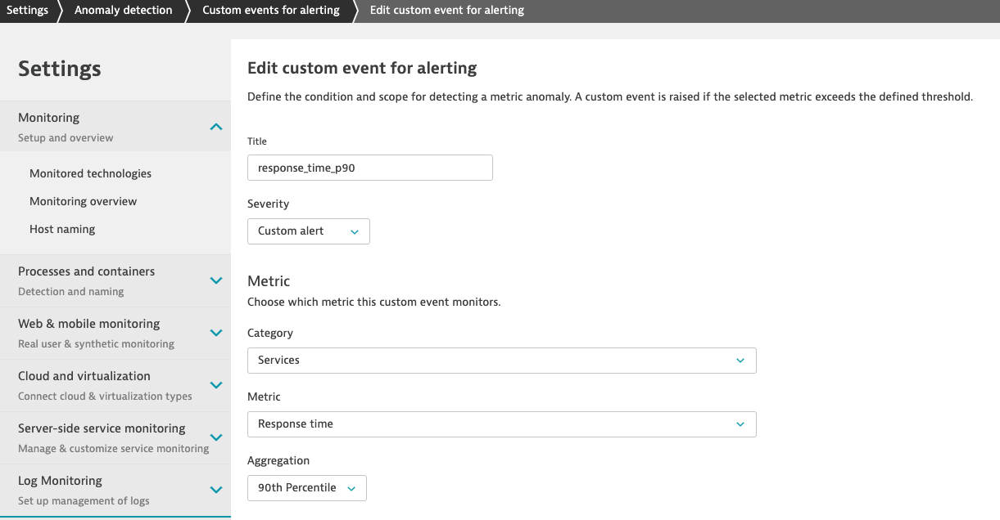

# Keptn Feature-Toggle Self-Healing

This document describe how Keptn leverages feature toggle frameworks to enable self-healing for applications by automatically toggling feature toggles in response to problem tickets that are reported to Keptn.

At first, we describe how to write remediation actions agnostic to the actual feature toggle framework used. Secondly, we describe how a user would work with Keptn as a control plane to toggle feature flags for automated operations of the users applications. 
Please note that in the current version, Keptn will provide built-in functionality for the open-source feature toggle framework [Unleash](https://unleash.github.io/), with other feature toggle platforms to follow.


# Prerequisites


*   Running Keptn Installation
*   Running [Unleash](https://unleash.github.io/) server as the feature toggle framework
*   Application with feature flags connected to the Unleash server
*   Remediation file with feature flags to toggle in case of issues
*   Running monitoring solution for the application (right now Dynatrace is supported)


# Remediation file

The remediation file is necessary to define which remediation action should be taken in response to a problem ticket that is sent to Keptn. Keptn’s internal remediation service will then determine the actions to take and trigger them accordingly. 

Here’s an example of a remediation file:

remediation.yaml

```yaml
remediations:
- name: "responsetime_p90_sockshop_carts"
  actions:
  - action: "featuretoggle"
    value: "enablecache:on"
```


*   `name`: it is the name of the violated SLO or type of problem.
*   `actions`: a list of actions that can be executed to remediate the problem
*   `action`: name of the action as well as the value which should be set. I.e., the action should be set to `featuretoggle`, the value defines which feature toggle as well as the new value the feature toggle should be set to. In this case, the name of the feature toggle is `enablecache` and the value will be set to `on` once this remediation is executed.


# User Walkthrough


## Setup & Configure Keptn 

As you would normally do with Keptn, create a project, onboard a service, and deploy your service into your Kubernetes cluster.

<details><summary>Instructions</summary>

### Create project 

Create a Keptn project which where you want to onboard your service. Define all stages you want to have in your project in a shipyard file, similar to the [Keptn docs](https://keptn.sh/docs/0.5.0/usecases/onboard-carts-service/#create-project-sockshop).

```
keptn create project PROJECTNAME --shipyard=shipyard.yaml
```


### Onboard a service

Onboard the service and add the remediation file as a resource.


```
keptn onboard service SERVICENAME --project=PROJECTNAME --chart=HELMCHART
```


Configure Keptn - add the remediation file


```
keptn add-resource --project=PROJECTNAME --service=SERVICENAME --stage=STAGENAME --resource=remediation.yaml
```

Deploy your application to Keptn.

```
keptn send event new-artifact --project=PROJECTNAME --service=SERVICENAME --image=docker.io/IMAGENAME --tag=TAG
```

</details>


### Add secret for Unleash server

In order to let the Keptn built-in Unleash remediation service communicate with the Unleash server, provide the credentials in terms of a Kubernetes secret.

unleash-secret.yaml:

```yaml
apiVersion: v1
kind: Secret
metadata:
  name: unleash-secret
type: Opaque
data:
  username: unleash-username
  token: unleash-token
  server-url: unleash-server-url
```


Apply the secret to the cluster.

```
kubectl apply -f unleash-secret.yaml -n keptn
```

<!--
ALTERNATIVE

```
#keptn add secret secret.yaml # needed to access the unleash server
#keptn apply uniform --project=PROJECTNAME uniform.yaml
```

uniform not needed right now since unleash is built in as action in Keptn core remediation service 
-->

### Configure your monitoring

To be able to react on any issues in your environment, the monitoring solution has to be setup and configured to send details of the detected issue to Keptn. In case of Dynatrace, this is how it would look like:

1. Follow the Keptn docs to setup Dynatrace [as described here](https://keptn.sh/docs/0.5.0/reference/monitoring/dynatrace/).

2. Set up a custom alert rule to be notified if the 90th percentile of the response time of your service is slower than expected. This custom alert rule does very much depend on your [SLOs](https://github.com/keptn/spec/blob/master/sre.md). 

    An example can be seen in this screenshot:
    

    Please note that in this case, the title of the custom alert has to match the remediation name in the remediation.yaml file, i.e., in this case `responsetime_p90_sockshop_carts`.


### Watch self healing in action

Now, if the response time of your service is slower than defined in your SLOs, the monitoring tool will send out an alert (problem ticket) to Keptn. Keptn on the other hand will find that there is a remediation set for the affected service (defined in the remediation.yaml file). Thus, Keptn will trigger the remediation, by making an API call to the feature toggle server and set the toggle to the desired state described in the remediation action. Afterwards, Keptn will send out a `sh.keptn.events.deployment-finished` event (TODO verify what is correct event type) to verify via the Keptn quality gates if the remediation access was successful. 


# **ACTION ITEMS for implementation**

*   Setup Unleash server for demo
*   Integrate Feature toggle into demo application
*   Build featuretoggle action for remediation service (in Keptn core)
*   Provide load generation script (for demo)
*   Provide instructions to setup custom alerting rule in Dynatrace (not yet available via API)

# Open Issues to be discussed

* If and how to sync state of all feature toggles to Keptn config repository
    - Most feature toggle frameworks provide webhooks which could be used to sync state. However, each framework has different payload to define a feature toggle.

* Extraction of feature toggle remediation into own services. Or better abstract the remediation action to be just a container to run when needed (instead of having services running in the cluster all the time).

